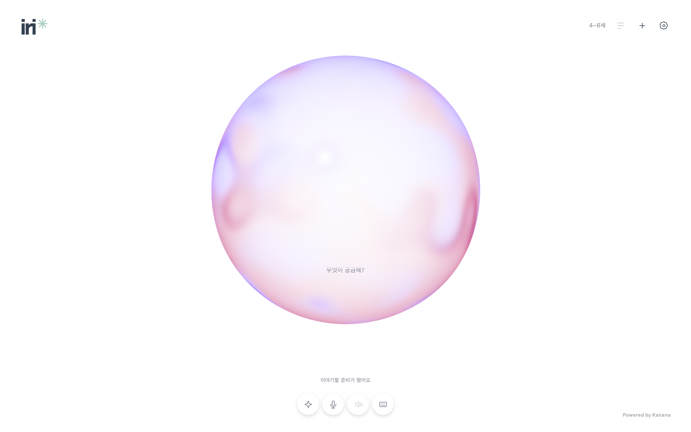
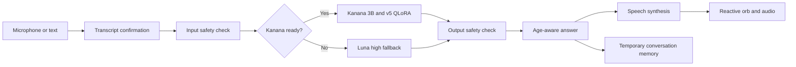

<h1 align="center">iri ✳</h1>

<p align="center">
  <strong>Curiosity, spoken.</strong>
</p>

<p align="center">
  <em>A voice-first Korean AI companion for curious children from 4 to 10.</em>
</p>

<p align="center">
  <a href="https://iri.today"></a>
  <a href="https://huggingface.co/peerproblem/Kanana-IRI-3B-QLoRA"></a>
  
  
  
</p>

<p align="center">
  
</p>

Children ask questions out loud. IRI listens, lets them confirm what it heard, creates an age-aware answer, and speaks it back in warm Korean. A reactive orb turns listening, thinking, and speaking into something a child can see.

```text
voice or text  →  transcript check  →  guarded answer  →  spoken response
```

IRI is a research demo, not a safety-certified child product. The current model is the strongest validated project candidate, but its independent final holdout is still incomplete. Public release for unsupervised child use is not approved.

## Try the Demo

Open **[iri.today](https://iri.today)** with a guardian and start talking or typing. No account, participant code, or login step is required.

The hosted GPU is normally stopped. When Kanana is unavailable, the API reruns the complete input, generation, and output-checking path with the configured Luna fallback. The demo never starts a GPU automatically.

## What IRI Does

- Accepts microphone input or typed Korean questions.
- Shows the transcript before a child sends it.
- Adapts answers for ages `4-6` or `7-10`.
- Uses one shared AnswerProfile across Kanana and the fallback model.
- Applies input and output safety checks around generation.
- Reads approved answers with a consistent, warm Korean voice.
- Keeps the six most recent turns in temporary server memory.
- Supports replay, stop, mute, new-story, and age-change controls.
- Reacts visually while listening, thinking, and speaking.

## How It Works



### Model Route

| Layer | Implementation |
| --- | --- |
| Primary generation | [Kanana 2 3B Instruct](https://huggingface.co/kakaocorp/kanana-2-3b-instruct/tree/6a5d7889964c4c590299d16e309eabab1f73f8a9) with the published [IRI v5 QLoRA adapter](https://huggingface.co/peerproblem/Kanana-IRI-3B-QLoRA) |
| Input and output guards | The frozen Kanana base model plus the `kanana_v5` behavior profile |
| Fallback | `gpt-5.6-luna` with high reasoning effort, running the full guarded path again |
| Speech to text | `gpt-4o-mini-transcribe` |
| Text to speech | `gpt-4o-mini-tts-2025-12-15`, `coral`, speed `0.95` |
| Product UI | React 19, TypeScript, Three.js, and Vite |
| API | FastAPI on Python 3.12 |

## Hugging Face Release

The complete adapter history is published at **[peerproblem/Kanana-IRI-3B-QLoRA](https://huggingface.co/peerproblem/Kanana-IRI-3B-QLoRA)**. The repository root contains the selected v5 adapter. Every earlier release remains available under `versions/` so the training and evaluation sequence stays auditable.

| Release item | Pinned value |
| --- | --- |
| Base model | `kakaocorp/kanana-2-3b-instruct` |
| Base revision | `6a5d7889964c4c590299d16e309eabab1f73f8a9` |
| Adapter repository | `peerproblem/Kanana-IRI-3B-QLoRA` |
| Published release commit | [`0880ce0372cedf22aec91b190f8a7b9499ccc176`](https://huggingface.co/peerproblem/Kanana-IRI-3B-QLoRA/tree/0880ce0372cedf22aec91b190f8a7b9499ccc176) |
| Root adapter | v5, served as `iri-kanana3b-v5-0ecacdb7d7f7` |
| v5 adapter SHA-256 | `0ecacdb7d7f743652a24ff7b7e7c59d0e2ae238e63476e64b2d6d95e8fbe2e02` |
| Version history | `versions/v1` through `versions/v5` |
| Access | Public release metadata; file access remains subject to Hugging Face and base-model license terms |
| Release inventory | Verified against the local release index |

Each version includes adapter weights, configuration, tokenizer files, and release metadata. v2 through v5 also include their available training manifests. The root `version-index.json` records data sizes, evaluation outcomes, and weight hashes for every version.

### Load the pinned v5 adapter

Authenticate with Hugging Face when required and accept the Kanana base-model license. The adapter repository does not contain the base weights.

```python
from huggingface_hub import snapshot_download
from peft import PeftModel
from transformers import AutoModelForCausalLM, AutoTokenizer

BASE_ID = "kakaocorp/kanana-2-3b-instruct"
BASE_REVISION = "6a5d7889964c4c590299d16e309eabab1f73f8a9"
ADAPTER_ID = "peerproblem/Kanana-IRI-3B-QLoRA"
ADAPTER_REVISION = "0880ce0372cedf22aec91b190f8a7b9499ccc176"

adapter_path = snapshot_download(
    repo_id=ADAPTER_ID,
    revision=ADAPTER_REVISION,
)
tokenizer = AutoTokenizer.from_pretrained(BASE_ID, revision=BASE_REVISION)
base_model = AutoModelForCausalLM.from_pretrained(
    BASE_ID,
    revision=BASE_REVISION,
    torch_dtype="auto",
    device_map="auto",
)
model = PeftModel.from_pretrained(base_model, adapter_path)
```

To reproduce a historical release, download the same pinned repository commit and load the matching `versions/vN` directory with `PeftModel.from_pretrained`.

> [!WARNING]
> The adapter alone does not contain IRI's input checks, output checks, deterministic safety routes, rate limits, or service policy. Do not expose the raw adapter as a child-safety product. The Kanana Open License in the release repository applies, and Kakao did not endorse this project.

## Quick Start

Requirements:

- Python 3.12
- [uv](https://docs.astral.sh/uv/)
- Node.js with npm

Install the local dependencies:

```bash
git clone https://github.com/peer-problem/iri.git
cd iri

uv sync --project runpod --frozen
runpod/.venv/bin/python -m runpod.operations.init_local
npm ci --prefix web
```

`init_local` creates private API credentials in `.keys/.env` without overwriting existing values. Add the provider configuration required by your environment:

```dotenv
MODEL_REVISION=6a5d7889964c4c590299d16e309eabab1f73f8a9
ADAPTER_NAME=iri-kanana3b-v5-0ecacdb7d7f7
ADAPTER_REVISION=0880ce0372cedf22aec91b190f8a7b9499ccc176
ADAPTER_SHA256=0ecacdb7d7f743652a24ff7b7e7c59d0e2ae238e63476e64b2d6d95e8fbe2e02
BEHAVIOR_PROFILE=kanana_v5
MODEL_BASE_URL=http://127.0.0.1:8002/v1
OPENAI_API_KEY=...
```

Start the API and web app together:

```bash
.ops/run.sh
```

Open [http://127.0.0.1:5173](http://127.0.0.1:5173). The API listens on `127.0.0.1:8000` by default.

> [!NOTE]
> `.ops/run.sh` does not start a GPU model server. Connect `MODEL_BASE_URL` to an authenticated local tunnel when testing Kanana. If Kanana is not ready and `OPENAI_API_KEY` is configured, chat uses the fallback route.

## Conversation API

Internal clients authenticate with `Authorization: Bearer <SANDBOX_API_KEY>`. Browser access is anonymous. Opening the page only reads any existing conversation and does not issue a token. The first state-changing request creates a short-lived HttpOnly cookie automatically for conversation isolation, rate limits, and checked-answer speech playback.

| Endpoint | Purpose |
| --- | --- |
| `GET /health` | Report API and model configuration state. |
| `GET /ready` | Confirm that the required base and adapter aliases are reachable. |
| `POST /transcribe` | Accept consented audio and return a transcript for confirmation. |
| `POST /chat` | Generate a guarded answer for an age band. |
| `POST /speech` | Return verified WAV audio for an answer approved by `/chat`. |
| `POST /speech-stream` | Stream verified PCM as completion-aware SSE events. |
| `GET /conversation` | Restore the current in-memory demo conversation. |

Speech synthesis is split into bounded segments. Each segment must finish the
upstream SSE protocol and pass a transcription-based ending check before it is
released. The streaming endpoint finishes with an `audio.done` event containing
the total byte count, segment count, and SHA-256 digest; incomplete streams end
with `audio.error` and must not be cached by clients.

The core request shape is intentionally small:

```json
{
  "message": "Why is the sky blue?",
  "age_band": "7-10"
}
```

## Current Status

| Area | Status |
| --- | --- |
| Voice demo | Deployed on Vercel with the API on Contabo |
| Kanana adapter | v5 selected and published with versions v1 through v5 preserved |
| GPU policy | Off by default, one pod maximum, no automatic start |
| v5 vLLM serving proof | Not run. The existing A40 vLLM receipt belongs to v1 |
| v5 independent final holdout | Not completed because no execution host was allocated |
| Public child release | Not approved |

The v5 adapter had the lowest validation loss among the comparable three-epoch candidates from v2 through v5. It also passed clean-process reload and targeted correction checks. Earlier candidates exposed material safety failures. The repository keeps the selected summary reports and release metadata, while removed intermediate runs remain recoverable from Git history.

- [v1 through v5 assessment](runpod/artifacts/kanana-performance-assessment-20260919/README.md)
- [Phase 3 closeout](runpod/artifacts/phase3-closeout-20260919/README.md)
- [Evaluation and review archive](runpod/artifacts/README.md)
- [Published adapter and serving guide](runpod/HF_SERVING.md)

## Safety and Data Boundaries

| Boundary | Behavior |
| --- | --- |
| Conversation memory | Keeps the latest six turns in server memory for up to one hour. |
| Deletion | New story and age change clear the active conversation context. |
| Audio | Recording is limited to 60 seconds. Audio is not stored by this application. |
| Disk storage | The application does not persist recordings or conversations to disk. |
| External processing | Audio and questions may be processed by configured external AI providers. |
| Secrets | Provider keys remain in `.keys/.env` or server runtime configuration. They are never sent to the browser. |
| GPU | A stopped model returns `503` from `/ready`. Process exit alone is not treated as a stopped pod. |

## Development

Run the local checks from the repository root:

```bash
runpod/.venv/bin/python -m pytest -q -c runpod/pyproject.toml
runpod/.venv/bin/ruff check --config runpod/pyproject.toml api runpod
npm test --prefix web
npm run build --prefix web
```

GPU serving and evaluation run in separate terminals on an NVIDIA Linux host:

```bash
python -m runpod.operations.serve_model
python -m runpod.operations.evaluate \
  --data runpod/data/kanana_v5_holdout.jsonl \
  --mode both \
  --behavior-profile kanana_v5
```

Before starting a GPU, record its hourly price and expected duration. Save checkpoints and results before stopping. Confirm the pod is actually `STOPPED` or `EXITED` through Runpod before considering the session closed.

## Repository Layout

```text
api/                 FastAPI product API, safety policy, and API tests
web/                 React voice interface and audio controls
runpod/              Training, serving, data preparation, and evaluation
runpod/artifacts/    Selected evidence and summary reports
.ops/                Run, serve, and production entrypoints
.logs/               Local operational records excluded from Git
.keys/               Local secrets and SSH material excluded from Git
```

## Operations

- [Deployment and rollback](api/deploy/README.md)
- [Hugging Face serving](runpod/HF_SERVING.md)
- [Web implementation notes](web/README.md)

The model history, incomplete evaluations, and known limitations are part of the deliverable. Do not relabel AI review as human review, incomplete validation as a pass, or a supervised research demo as an approved public child product.
